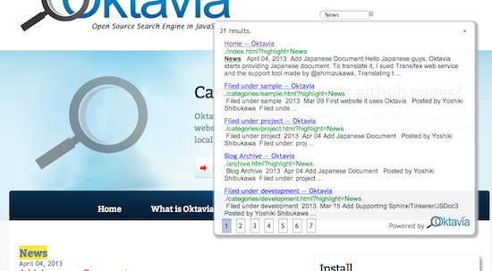

Version 0.5 Released
====================

New version 0.5 is released. From this version, version number will be added.

* Web Interface

  * Search words highlight (Thank you @r_rudi!).
  * Sync index loading
  * New logo in the search result page

* Command line tool

  * Index Generator's default output become ``-t js``.
  * Search Tool accepts ``.js`` and ``.b64`` in addition to ``.okt``.

.. author:: default
.. categories:: development
.. tags:: release, update
.. comments::
