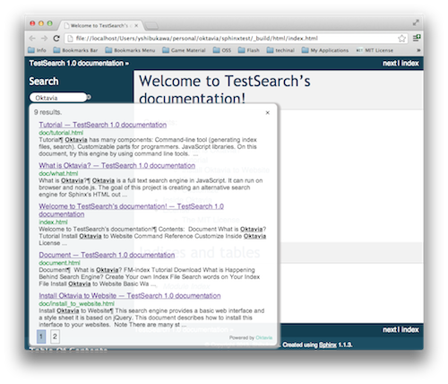
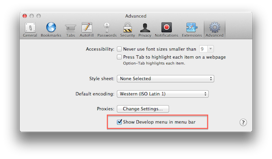
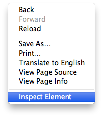
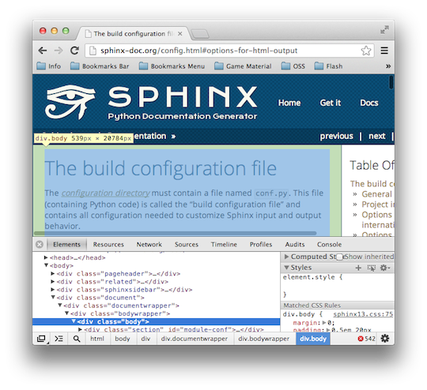

Install Oktavia to Sphinx
=========================

Using this search engine with `Sphinx <http://sphinx-doc.org>`_ is easy.

There are two steps to install Oktavia to your Sphinx document.

1. Prepare index file
2. Change Sphinx template

Prepare Index File
------------------

Download Oktavia tools and libraries from github.

* https://github.com/shibukawa/oktavia

This document assumes ``oktavia`` folder is in your Sphinx doucment folder.

Install node.js if you didn't try tutorial. The index generator needs node.js to run.
`node.js website <http://nodejs.org/download/>`_ provides detail information to install node.js
to any platforms.

At first, open your resulting document by a browser. WebKit based browsers for PC (Google Chrome, Safari)
provide a useful tool. If you are using Safari, check "Show Develop menu" option.

Move a mouse cursor on the content and select "Inspect Element" from a context menu. You can see which tag
contains page content. ``
`` tag keeps content in most cases unless you use a fully customized original theme.

You can create index file by using following command:

.. code-block:: bash

  $ oktavia/bin/oktavia-mkindex -i _build/html -r _build/html
     -m html -t js -u file -f .body -c 5

1. If your content is not in ``
`` tag, modify ``-f .body`` part.
2. If your Sphinx project uses ``Separate source and build directories`` option, change ``-i`` and ``-r``
   options to following:

   .. code-block:: bash

      $ oktavia/bin/oktavia-mkindex -i build/html -r build/html

The meaning of ``-u`` option and ``-c`` option are described in :doc:`tutorial`.

Check the index generator's ``Source text size:`` line. If this number is fewer than 100 bytes,
``-f`` parameter is wrong.

Can you see ``_build/html/search/searchindex.js`` file? If the file extension is not ``.js``,
You forget ``-t js`` option.

Then add a line to run the index generator into ``html`` section to run the index generator
every time you build Sphinx document.

.. code-block:: make

   html:
           $(SPHINXBUILD) -b html $(ALLSPHINXOPTS) $(BUILDDIR)/html
           oktavia/bin/oktavia-mkindex -i _build/html -r _build/html -m html -t js -u file -f .body -c 5
           @echo
           @echo "Build finished. The HTML pages are in $(BUILDDIR)/html."

Change Sphinx Template
----------------------

There is a template in `the github repository <https://github.com/shibukawa/oktavia/tree/master/templates/sphinx>`_.

1. After creating a project folder (by using ``sphinx-quickstart``), copy needed files into a ``_static`` folder.

   * ``oktavia-search.js`` or ``oktavia-*-search.js``
   * ``oktavia-jquery-ui.js``
   * ``searchstyle.css``

2. Add a search form entry point to a HTML template.

   Add following contents into your ``_templates/layout.html`` or copy the file in the template.

   .. code-block:: jinja

      

      
      {{ super() }}
      

         
         
         <link rel="stylesheet" href="{{ pathto("_static/searchstyle.css", 1) }}" type="text/css" />
         <h3>Search by Oktavia</h3>
         

      

      

   If you override ``sidebarsearch`` block, it is appear the bottom of a sidebar. Above case shows the top of a sidebar.

3. Suppress an existing search form.

   Add an empty ``_templates/searchbox.html`` file or add following lines to ``_templates/layout.html``:

   .. code-block:: jinja

      

      
      

