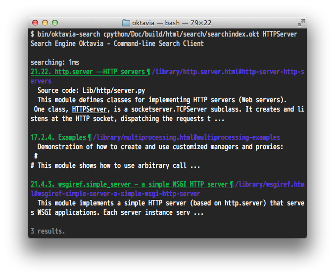

========
Tutorial
========

Oktavia has many components:

* Command-line tool (generating index files, searching).
* Customizable parts for programmers.
* JavaScript libraries.

In this document, try this engine by using command line tools.

Download
========

Download Oktavia tools and libraries from github.

* https://github.com/shibukawa/oktavia

It needs node.js. Version 0.8.21 is confirmed to run it. Before running commands, install node.js.
`node.js website <http://nodejs.org/download/>`_ provides detailed information to install node.js on any platform.

Oktavia provides a simple tool ``httpstatus``. It is a utility program to check the HTTP status codes. It is in ``bin`` folder.
Use like this:

.. code-block:: bash

   $ bin/httpstatus 30
   300: Multiple Choices
   301: Moved Permanently
   302: Found
   303: See Other
   304: Not Modified
   305: Use Proxy

It returns status codes that includes "30".

Oktavia provides Google style search query syntax, except number ranging queries:

* All words: ``word1 word2``
* Exact words or phrase: ``"word1 word2"``
* Any of these words: ``word1 OR word2``
* None of these words: ``-word1``

For example, the following query returns lines that contain "40" and don't contain "not":

.. code-block:: javascript

   $ ./httpstatus 40 -not
   400: Bad Request
   401: Unauthorized
   402: Payment Required
   403: Forbidden
   407: Proxy Authentication Required
   408: Request Timeout
   409: Conflict

What is Happening Behind the Search Engine?
===========================================

Inside search engines, there are following steps:

* Create an index file from source text.

  * Read source contents.
  * Store an index file.

* Search content and show result.

  * Read an index file.
  * Receive and parse a user query.
  * Search words.
  * Summarise each word's result.
  * Show result.

``httpstatus`` is simple but it contains all parts of the search engine.

Create Your own Index File
==========================

Now Oktavia provides an index generator tool from HTML documents, ``oktavia-mkindex``. Let's try creating an index of a Python document.
Before trying this, you should install Mercurial.

You can clone Python's repository like this:

.. code-block:: bash

   $ hg clone http://hg.python.org/cpython

After cloning the Python source code, let's build an HTML document like the following:

.. code-block:: bash

   $ cd cpython/Doc
   $ make html
   (wait)

Resulting HTML files are in a ``cpython/Doc/build/html`` folder. To create an index file, it needs following information.

* Input files: ``cpython/Doc/build/html``
* Document root: ``cpython/Doc/build/html``
* Mode: ``html``
* Search-unit: ``file``, ``h1`` etc...
* Filter: HTML tag, id, class etc...
* Cache Density(%).

Index generator can accept as input each files or folders. The ``oktavia-mkindex`` can accept several inputs at the same time by
using ``-i`` or ``--input`` parameters. You should select only pages that contains valuable information.
The Python document contains index pages. These pages don't have information themselves.

Document root is important for the index file for web browsers. An index file stores the relative path from this path to each file.

Python has a file ``library/os.html`` in ``cpython/Doc/build/html``. The following table is a sample of the document root option:

.. list-table::
   :header-rows: 1

   - * Document Root
     * Result Path
   - * ``cpython/Doc/build/html``
     * ``/library/os.html``
   - * ``cpython/Doc/build/html/library``
     * ``/os.html``

Use ``-r`` or ``--root`` option to specify a document root.

The current version of Oktavia only supports HTML as a mode. Use ``-m html``.

A search-unit specifies grain sizes of information. If ``file`` is specified as a search-unit, the summarizer binds found words in the same page.
If ``h1`` is specified, the result is separated by the heading level. Let ``oktavia-mkindex`` know a search-unit by using ``-u`` or ``--unit`` option.

A filter is important to reduce noise from search results. HTML files contains header, sidebar, footer and so on. Each Python document has
a ``
`` tag. Outside of this tag is a content generated by the HTML template. These contents should not be in the search index.
``oktavia-mkindex`` will ignore them if you pass ``-f .body`` or ``--filter .body`` option into ``oktavia-mkindex``.

Cache density effects the resulting file size and performance. The default value is "5" (%). Cache density and cache size are increase commensurately and the
search response time is in inverse proportion to them.
The Python document contains 10MB texts in UTF-16 (a text encoding used in JavaScript). If you use "5", the resulting cache size become 4MB.

If the total file size is bigger than 10MB and you want to provide searching features for the browser, you should use 1 or 2 or less.
If you set a bigger value like 25, you can achieve amazing speed.

You can create index file like this:

.. code-block:: bash

  $ bin/oktavia-mkindex -i cpython/Doc/build/html/library -i cpython/Doc/build/html/c-api
    -i cpython/Doc/build/html/reference -i cpython/Doc/build/html/tutorial
    -r cpython/Doc/build/html -m html -u h2 -f .body -c 5

It takes about 20 seconds on my computer.

You get a search index file in ``cpython/Doc/build/html/search/searchindex.js``. It contains information about "Language Reference", "Library Reference", "C-API" and "Python Tutorial".

Search words on Your Index File
===============================

Oktavia provides a search command ``oktavia-search``. The first parameter of this command is a search index file. Remaining parameters are search words.

